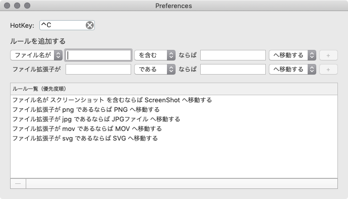

# Desktop-Cleaner

Macのデスクトップを一瞬で整理するツールです。

[Download ⬇️](https://github.com/Kyome22/Desktop-Cleaner/blob/master/Desktop%20Cleaner.zip)

*****

Preferencesで整理を発動するショートカットキーを設定できます。

また，ファイルやフォルダを整理するルールを追加できます。

ルールは一覧の上から優先されて実行されます。（順番はドラッグで変更できます。）

